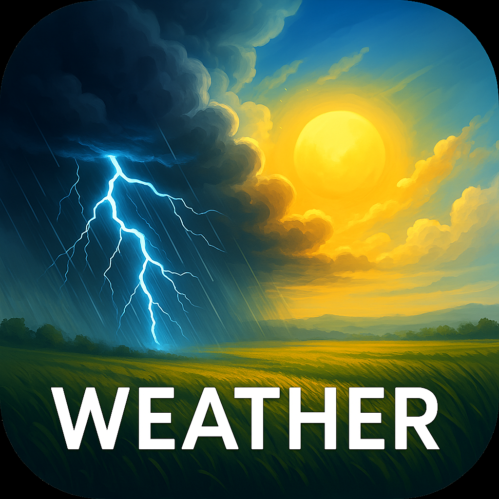

<p align="center">
  
</p>

# 🌦️ AI-Powered Weather & Market Prediction App

## 📘 Summary

An AI-powered weather and market forecasting application designed to empower farmers and agribusiness stakeholders in Africa. It provides:

- Real-time **weather predictions**
- **Crop market price forecasting**
- AI-driven **credit scoring**
- Blockchain-enabled **smart contracts**
- Emergency alerts and climate resilience insights

Built with a full-stack architecture, the app combines **AI models**, **secure APIs**, **cloud deployment**, and a mobile-first frontend to deliver accurate, scalable, and accessible solutions.

---

## 💻 Development Languages & Frameworks

| Layer        | Technology Used                          |
|--------------|-------------------------------------------|
| **Backend**  | Python, Flask, FastAPI                    |
| **AI Models**| TensorFlow, Scikit-learn, Pandas, NumPy   |
| **Frontend** | React Native / Flutter / Kotlin (Android)|
| **Database** | PostgreSQL, MongoDB                      |
| **Blockchain**| Solidity, Ethereum, Hyperledger          |
| **Cloud**    | AWS / Google Cloud / Azure               |

---

## 📚 Documentation

All documentation lives in the `docs/` directory.

### Key Docs

- `docs/setup.md` – Step-by-step environment setup
- `docs/api-spec.md` – API endpoints and response formats
- `docs/ai-models.md` – AI model architecture and training details
- `docs/blockchain-integration.md` – Blockchain structure and logic
- `docs/contributing.md` – Contribution best practices

---

## 🚀 Installation Guide

### 1. **Clone the Repository**

```bash
git clone https://github.com/joeythe33rd/weather-ai-app.git
cd weather-ai-app
```

### 2. **Install Backend Dependencies**

```bash
pip install -r requirements.txt
```

### 3. **Start Flask Server**

```bash
python app.py
```

### 4. **Setup Frontend (React Native)**

```bash
cd frontend
npm install
npm start
```

### 5. **Database Setup (PostgreSQL)**

Ensure PostgreSQL is installed and run:

```sql
CREATE DATABASE weather_db;
```

Then:

```bash
python setup_db.py
```

---

## 🤝 Contribution Guidelines

We welcome contributors to improve the project!

1. Fork the repository.
2. Create a feature branch:

```bash
git checkout -b feature-your-feature-name
```

3.Make your changes and commit:

```bash
git commit -m "Add: Your detailed message"
```

4.Push and open a pull request:

```bash
git push origin feature-your-feature-name
```

### ✅ Contribution Checklist

- [ ] Follow PEP8 standards (Python)
- [ ] Write or update tests
- [ ] Add documentation for new features
- [ ] Link any related issues in your PR

---

## 🛠️ Patching Guidelines

To patch bugs or security vulnerabilities:

- Open an issue with a detailed description.
- Reference issue number in commits (e.g., `Fixes #45`)
- Use semantic versioning:
  - Patch: `v1.0.1`
  - Minor Feature: `v1.1.0`
  - Major Release: `v2.0.0`

---

## 📦 Resources

| Resource              | Link                                                   |
|-----------------------|--------------------------------------------------------|
| OpenWeatherMap API    | [openweathermap.org](https://openweathermap.org/api)   |
| NOAA Climate Data     | [ncei.noaa.gov](https://www.ncei.noaa.gov/)            |
| FAO Price Index       | [fao.org](https://www.fao.org/worldfoodsituation/)     |
| Kenya Met Department  | [meteo.go.ke](https://www.meteo.go.ke/)                |
| TensorFlow            | [tensorflow.org](https://www.tensorflow.org/)          |
| Solidity              | [soliditylang.org](https://docs.soliditylang.org/)     |
| React Native          | [reactnative.dev](https://reactnative.dev/)            |
| PostgreSQL            | [postgresql.org](https://www.postgresql.org/)          |

---

## 📄 License

This project is licensed under the **MIT License**.  
See the [LICENSE](./LICENSE) file for details.

---

## 🙌 Acknowledgements

Special thanks to:

- Kenyan farmers and agribusiness cooperatives
- Open-source developers and AI researchers
- Institutions contributing open data (NOAA, FAO, KenyaMet)

---

## 📫 Contact & Support

- **Lead Developer:** [Joseph Ndungu](https://www.linkedin.com/in/joseph-ndungu-74431b135/)
- **Email:** [jothefu@gmail.com](mailto:jothefu@gmail.com)
- **GitHub:** [joeythe33rd](https://github.com/joeythe33rd)
